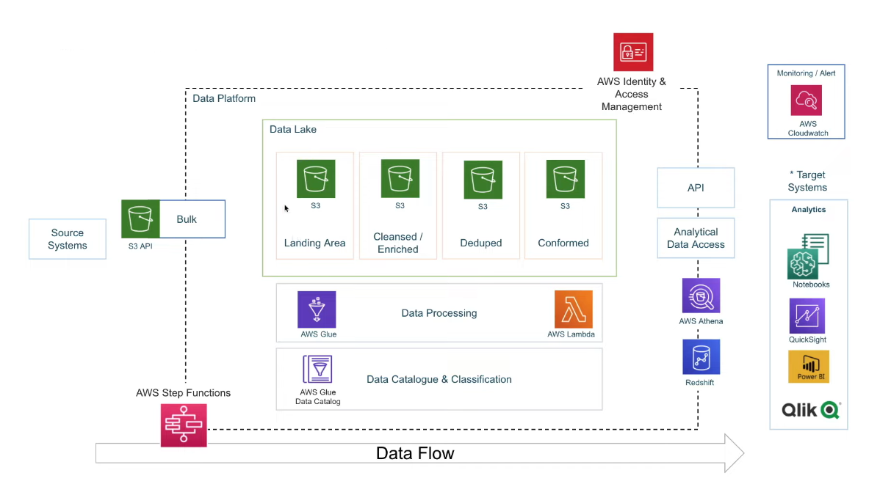

# Youtube-Data-analysis 
> In this project, I created a Data Pipeline using AWS and created a basic dashboard from the processed data

## 📚:Datasets:
* [Trending YouTube Video Statistics](https://www.kaggle.com/datasets/datasnaek/youtube-new)

 ## 🔧 Tools and Technologies:
* SQL
* Python3
* AWS S3, AWS IAM, AWS GLUE, AWS ATHENA, AWS LAMBDA, QuickSight

## 🏗️:Project Architecture:
> ETL architecture

## ☢️: Project Steps:
* Downloaded the datasets from kaggle.
* Uploaded the data from my local machine to S3 using AWS CLI commands. Separated the data stored in different folders based on their extension(CSV and JSON).
> [s3_cli_command.sh](aws cli.txt)
* Used Crawler in AWS Glue Catalog to crawl the data from JSON and CSV files from the raw bucket and store them in separate database which then could be queried in Athena.
* If problems arise as a result of data in JSON format, wrote a Python function using AWS Lambda to clean them up and convert them to parquet format.
> [lambda_function.py](lambda function.txt)
* Added a trigger to the Lambda function to run whenever any data with .json extension would added to the S3 bucket, and the output was to be saved in a database in Athena.
* Converted the CSV files into parquet format with help of AWS Glue ETL.
> [glue-script.py](glue script.txt)
* Created another Glue Crawler to crawl the clean data into the clean_database.
* After all the clean parquet files are converted from CSV and JSON files, they is present in the same database, did an ETL job using AWS Glue Studio to join both the tables and store it in a separate S3 bucket intended to use for Analytics purposes.
> [joining-script.py](joining)

* GG. The data is now ready!!!!! 👍
 Resouces:
[Kaggle](https://www.kaggle.com/)

### [QuickSight Dashboard](Youtube de dashboard.pdf)
